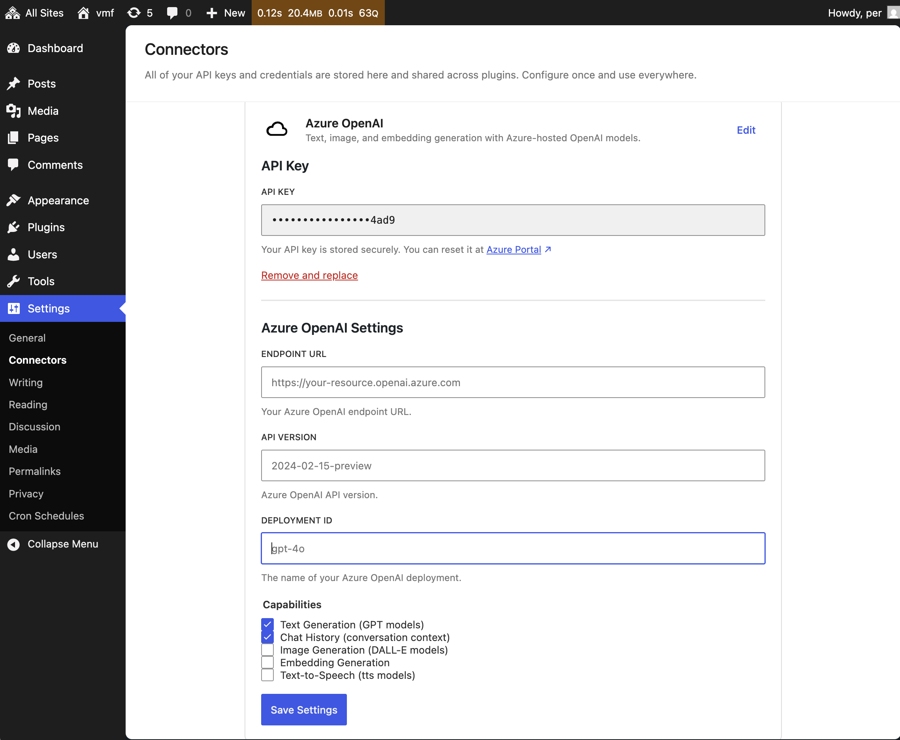

# AI Provider for Azure OpenAI

AI Provider for Azure OpenAI for the WordPress AI Client.

>I've tested the AI Provider for Azure OpenAI using [Virtual Media Folders AI Organizer](https://github.com/soderlind/vmfa-ai-organizer?tab=readme-ov-file#virtual-media-folders-ai-organizer)

## Description

This plugin provides Azure OpenAI integration for the WordPress AI Client, enabling text generation, image generation, embedding generation, and text-to-speech using Azure's hosted OpenAI models.

>BONUS: [How to Add a Custom AI Provider to WordPress 7+](https://github.com/soderlind/ai-provider-for-azure-openai/blob/main/docs/how-to-add-ai-provider.md) — a step-by-step guide for developers to add AI Connectors to WordPress, with code examples.

<!--img width="100%" alt="Screenshot 2026-03-01 at 16 53 43" src="https://github.com/user-attachments/assets/8db1909e-3fcd-4709-ad50-7554b03aa0e7" /-->




### Features

- Text generation using GPT-4, GPT-4o, GPT-4.1, GPT-3.5-Turbo deployments
- Image generation using DALL-E 2 and DALL-E 3 deployments
- Embedding generation using text-embedding-ada-002, text-embedding-3-small/large deployments
- Text-to-speech using tts-1 and tts-1-hd deployments
- Integrated into the Connectors settings page (Settings → Connectors) — configure API key, endpoint, deployment, and capabilities in one place
- Multimodal input support (text, image, audio, document combinations)
- Environment variable support for credentials

## Requirements

- WordPress 7.0 or higher
- PHP 7.4 or higher
- Azure OpenAI resource with deployed models

## Installation

1. Download [`ai-provider-for-azure-openai.zip`](https://github.com/soderlind/ai-provider-for-azure-openai/releases/latest/download/ai-provider-for-azure-openai.zip)
2. Upload via `Plugins → Add New → Upload Plugin`
3. Activate the plugin through the WordPress admin


Plugin [updates are handled automatically](https://github.com/soderlind/wordpress-plugin-github-updater#readme) via GitHub. No need to manually download and install updates.

## Configuration

### Connectors Page

1. Go to **Settings → Connectors**
2. Find **Azure OpenAI** and click **Set Up**
3. Enter your **API Key** (from Azure Portal → Your OpenAI Resource → Keys and Endpoint)
4. Enter your **Endpoint URL**, **API Version**, **Deployment ID**, and **Capabilities**
5. Click **Save Settings**

All settings are stored as individual options and exposed via the REST Settings API.

### Via Environment Variables

Set the following environment variables:

```bash
export AZURE_OPENAI_API_KEY="your-api-key"
export AZURE_OPENAI_ENDPOINT="https://your-resource.openai.azure.com"
export AZURE_OPENAI_API_VERSION="2024-02-15-preview"  # Optional
export AZURE_OPENAI_DEPLOYMENT_ID="gpt-4o"             # Optional
export AZURE_OPENAI_CAPABILITIES="text_generation,chat_history"  # Optional, comma-separated
```

**Available capabilities:** `text_generation`, `image_generation`, `chat_history`, `embedding_generation`, `text_to_speech_conversion`

Environment variables are used as fallbacks when settings are not saved in the database.

## Usage

Once configured, the Azure OpenAI provider is automatically registered with the WordPress AI Client and can be used like any other provider:

```php
use WordPress\AiClient\AiClient;

// Get an Azure OpenAI model
$client = AiClient::default();
$model = $client->getModel( 'azure-openai', 'gpt-4o' );

// Generate text
$result = $model->generateText( [
    [ 'role' => 'user', 'content' => 'Hello, how are you?' ]
] );

echo $result->getText();
```

## API Differences from OpenAI

Azure OpenAI uses a different URL structure:

```
{endpoint}/openai/deployments/{deployment}/chat/completions?api-version={version}
```

And uses the `api-key` header instead of `Authorization: Bearer`:

```
api-key: your-api-key
```

The plugin handles these differences automatically.

## Development

### Linting

```bash
composer install
composer lint:php
```

### Testing

```bash
composer test
```

## Credits

This plugin is based on [AI Provider for OpenAI](https://github.com/WordPress/ai-provider-for-openai) by the WordPress AI Team. It adapts the OpenAI provider architecture for Azure OpenAI's API format and authentication requirements.

## License

GPL-2.0-or-later
